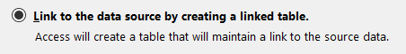

# ms-access-on-sql-server

Basic use case for editing an SQL server database through a MS Access form and auditing each updated row for user and time

## Setup the database

On an SQL Server instance, create a database called `CRUD_ACCESS`.
Run the `setup.sql` script to create the tables and views.

Showing the sample seeded rows.

## Create an ODBC connection to the SQL Server Database

From Windows search for ODBC (64-bit) and create a connection to you SQL Server instance.

## Setup the MS Access form

In MS Access, create a new database, and then go to New Data Source -> From Database -> From SQL Server.

Select link to the data source by creating a linked table.

Select the connection, and from the connection, select the two views (`questions_generic` and `questions_favourite`).

Then select the unique identifier of the table (in this case `question_id`)

Now you should be able to see the two views and look at the records.

## Making the from

Select one of the views and select create form

A blank for will be created and you can edit the field labels and titles.

Now to add the functionality such that the `edit_user_id` and `edit_datetime` are populated with the answer is completed and make all the other fields not editable.

Select the answer field, and in the properties sheet, on the Event tabe, click on the elipsis (...) on `After Update`.

Select the code builder.

Paste the contents of the `event.vba` script into the code builder.
Then for all fields except for `answer`, in the Property Sheet, in the Data tab, set them to `Locked = Yes`

Now if we open the form and add an answer to a question, we see the `edit_user_id` and `edit_datetime` automatically populating.

Going back to SSMS, and querying the table we see the rows have been updated with the values entered in the MS Access form.

